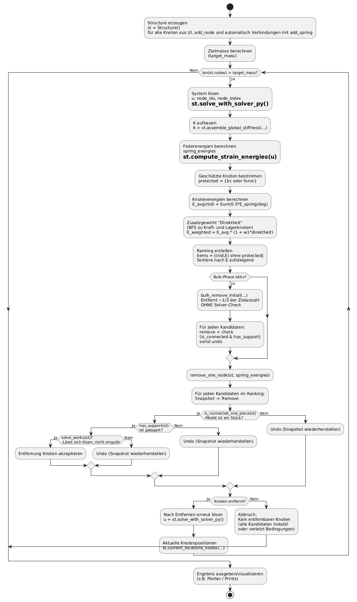

# Abschlussprojekt_Softwaredesign

# Umgesetzte Erweiterungen

## Knoten-Einstellungen
Knoten im visualisierten Strukturmodell können direkt angeklickt werden. Der ausgewählte Knoten wird automatisch im Bearbeitungsfenster markiert, sodass seine Lagereigenschaften (Boundary Conditions) sowie die auf ihn wirkenden externen Kräfte angepasst werden können.

## Mouseover
Beim Überfahren eines Knotens mit der Maus werden dessen Eigenschaften in einem Informationsfenster angezeigt (Knotennummer, Position, Boundary Conditions, einwirkende Kräfte).

## Heatmap
Alle Federverbindungen zwischen den Knoten sind abhängig von ihrer Belastung eingefärbt (hohe Belastung: rot, geringe Belastung: blau). Die Farbgebung aktualisiert sich dynamisch während der Optimierung.

## Parametersuche
Es kann eingestellt werden,
- wie viele Knoten zu Beginn direkt entfernt werden (Bulk-Phase) und  
- wie stark direkte Kraftlinien in der Bewertung berücksichtigt werden.  

Hierfür werden verschiedene Parameterkombinationen ausgewertet und eine optimale Kombination bestimmt.  
Zu finden im Interface unter **Optimierung → Parameter**.

## GIF- und ZIP-Export
Der gesamte Knoten-Reduktionsprozess kann als animiertes GIF heruntergeladen werden.  
Zusätzlich können alle Einzelbilder als ZIP-Datei exportiert werden.  

Beide Funktionen stehen nach Abschluss der Optimierung im Menüpunkt **„Optimierung“** zur Verfügung.

## Anpassung der Federsteifigkeit
Die Federsteifigkeit des Systems kann unter **„Modellparameter“** angepasst werden. Dadurch lassen sich die resultierenden Verschiebungen der Knoten besser an die gewählten Kraftwerte dimensionieren.

---

# Installation und Ausführung

Installation & Ausführung (Kurz-Anleitung)

1. Repository klonen und in den Projektordner wechseln:
git clone <REPOSITORY-URL>
cd <REPOSITORY-NAME>

2. Virtuelle Umgebung erstellen:
python -m venv venv

3. Virtuelle Umgebung aktivieren:

Windows:
venv\Scripts\activate

Mac/Linux:
source venv/bin/activate

4. Abhängigkeiten installieren (über requirements.txt):
pip install -r requirements.txt

5. Streamlit-App starten:
streamlit run app.py
Die Anwendung öffnet sich anschließend automatisch im Browser.

6. Breite und Höhe des gewünschten Objekts eingeben.

7. Optional: Federsteifigkeit unter „Modellparameter“ anpassen.

8. Simulation starten (Button „Simulation starten“).

9. Masse optimieren (Button „Optimieren“).
   Über die Buttons kann der Prozess gestartet oder gestoppt werden.
   Zusätzlich können einzelne Knoten über entsprechende Buttons entfernt werden.

10. GIF oder ZIP-Datei über die jeweiligen Buttons herunterladen.

11. Optimale Parameter über „Parameter ermitteln“ bestimmen
    (zu finden unter Optimierung → Parameter).

## UML-Diagramm

# Quellen / Nutzung von KI-Tools

Im Projekt wurden KI-gestützte Werkzeuge unterstützend verwendet, vor allem zur Fehlersuche, beim Debugging sowie zur Verbesserung der Code-Struktur. Außerdem dienten sie zur Erklärung und Analyse einzelner, komplexerer oder fremder Codeabschnitte.

Die fachliche Konzeption, die Entwicklung der Algorithmen sowie die vollständige Implementierung der Optimierungslogik wurden eigenständig erarbeitet. Vorschläge der KI wurden nicht direkt übernommen, sondern kritisch geprüft und bei Bedarf angepasst.